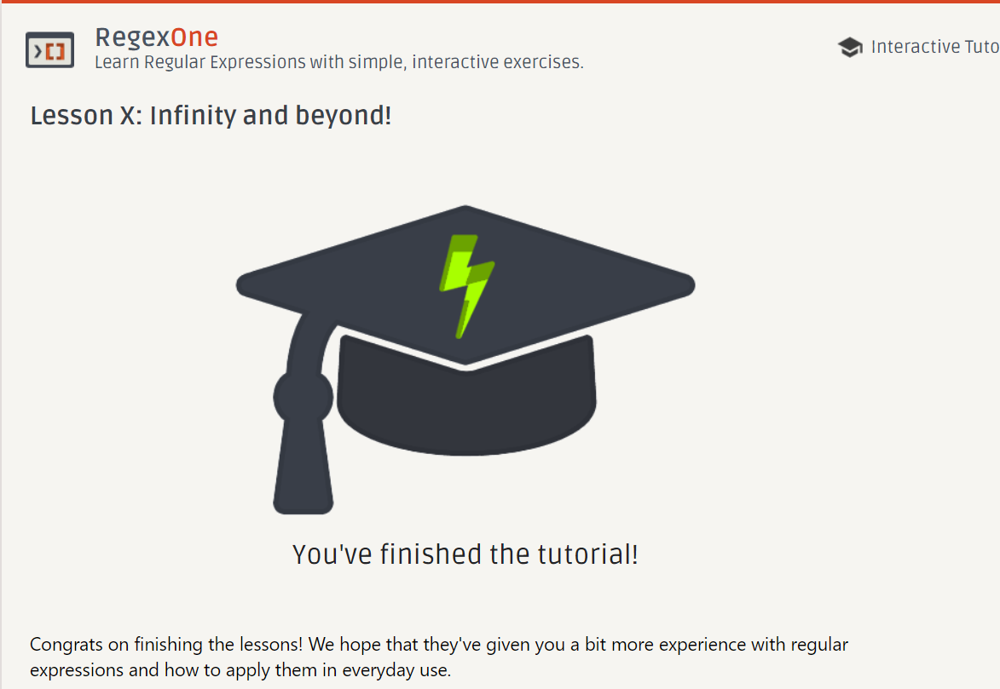

## Lab 1 - Adam Gibbons
### Part C: Reflections on Reading
##### 2.
The Smart Question guide was exhaustive... and savage... and entertaining. 
One way to answer questions would be to build an AI that can do it for you... perhaps some sort of "question" engine that a person can ask... we could call it question.com or a sillier name like snaazle... (unfortunately the domain STFW.com is taken)
But seriously, from my own experience the only bad answers are wrong answers. If someone simply gives me a link to a post or resource and the answer is in fact in there, then that's great because I'll ultimately solve my issue, and probably learn something in the process, that could help me be more resourceful in solving future problems. If the question is not ideally posed, perhaps it would be nice to answer kindly and thoroughly despite its deficiencies but also to instruct on how to improve the question. (or a link to the guide) But if it's your own open source community, you may not want to scare off newbees by being rude or unhelpful. They may ultimately become useful contributors ohne day.
##### 3.
That's a horror story. I may or may not have been an RPI student in '05, all of us may or may not have been aware of this story. Students may or may not have continued to place music files in their shared folders at least for short periods to until transfers could be completed (definitely not me… RPI encouraged us to use Ruckus, which placed ineffective security on its music files to keep them from being burned) All software issues aside, it is unfortunate that our legal system vastly favors those who can afford to litigate. What Jesse experienced was a terrible injustice. The publicity of such cases may have had a very mild (ultimately pointless) affect at the time. I can also remember my father admonishing me in the days of Napster because he had read somewhere that such lawsuits were occurring. But of course things like that never stopped anyone. It’s yet another example of how software can disrupt industries and even cultures and how people resist change. It’s not always a bad thing though. The entertainment industry is doing fine, Ubers are better than taxis, etc. It also reminds me of the dangers posed by software patents to open source. Particularly the unjust examples of patents being issued on overly simple software or even documented, pre-existing software. 
### Part D: linux

### Part E: regex

### Part F: blockly

### Part G: reflection
I’m noticing that the many successful open source projects seem to be tools for developers. Which is reasonable since developers are more likely to contribute to things that interest them or help them. Also such tools are more likely to be used as components in commercial products or businesses, which also seems to drive open source. So even though open source software is “free” I’m seeing less of an incentive to create purely fun/pointless things. I also I see less of an incentive to create complete products where your users are not developers. So for instance I wouldn’t mind creating (yet another) open source POS for restaurants but then my users are just restaurant workers and who is going to join my development community? Perhaps a better idea would be an open source solution to one of the more expensive/challenging aspects of the system like secure storage of customer’s payment information or payment processing. And even though I want it for restaurants, others may find any number of other places to use it and, therefore, take interest. 

So I’m trying to think in terms of practical tools. I’m also thinking of trying to incorporate skills that I want. So perhaps anything will do if lets me brush up on Node.js, or make an android app, or has me work with network protocols which would help me out in my IoT class. (Tensor flow sounds interesting if I can think of an AI related Idea like natural language processing which is an interest of mine, and I won’t be able to take the course while at RPI.) An RCOS project that piqued my interest was a library of animations for CSS3. I liked it because I saw myself using it for web development. I am very interested in investigating/learning about minds.com which is an open source social network with many interesting facets that set it apart from the likes of facebook. I believe Minds will also soon be releasing a decentralized social network called Nomad which I’ll certainly look into. It’s all very interesting, and I have to say that the prospect of contributing to open source projects/communities has made computer science very much more interesting and exciting.

