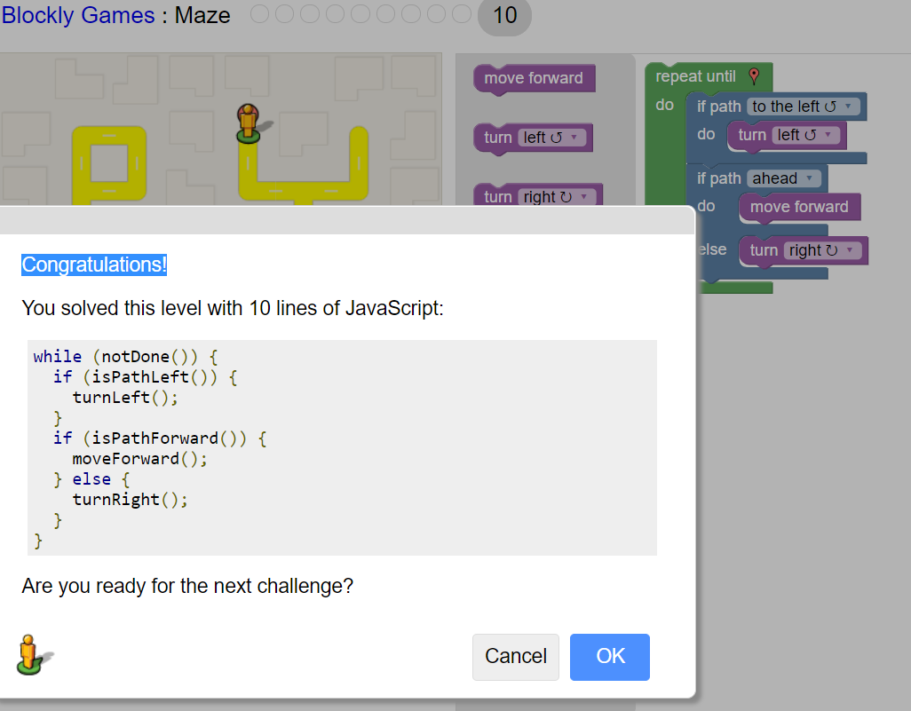

## Lab 1 - Adam Gibbons
### Part C: Reflections on Reading
##### 2.
... The Smart Question guide was exhaustive... and savage... and entertaining. It almost definately will save me (somewhat) from embarrassing myself and annoying others at some point in the futre. If following that guide doesn't work, then I don't know what will. Perhaps offering money would work (although they did suggest that). One idea they didn't mention would be to use multiple identities to help hide your shame.
##### 3.
That's a horror story. I may or may not have been an RPI student in '05, all of us may or may not have been aware of this story. RPI may or may not have paid for subscriptions to a music service called Ruckus to help avoid illegal file sharing among its students. Students may or may not have continued place music files in their shared folders (at least for short periods to until transfers could be completed). 

All software issues aside, it is very unfortunate that our legal system vastly favors those who can afford to litigate. What Jesse experienced was a terrible injustice. The publicity of such cases may have had a very mild affect at the time. We see an example in RPI, paying for music services so students wouldn't get sued (and whos to stop them from suing RPI or Microsoft for that matter... other than that they can afford to litigate). I can also remeber my father admonishing me in the days of napster because he had read somewhere that such lawsuits were occuring. But of course things like that never stopped anyone. 

This is an example of software disrupting an industry (which has since shifted and learned to cope). It also reminds me of the dangers of software patents for open source. Particularly the unjust examples of patents being issued on overly simple software or even documented pre-existing software. It's frusterating to 
### Part D: linux

### Part E: regex

### Part F: blockly

### Part G: reflection
